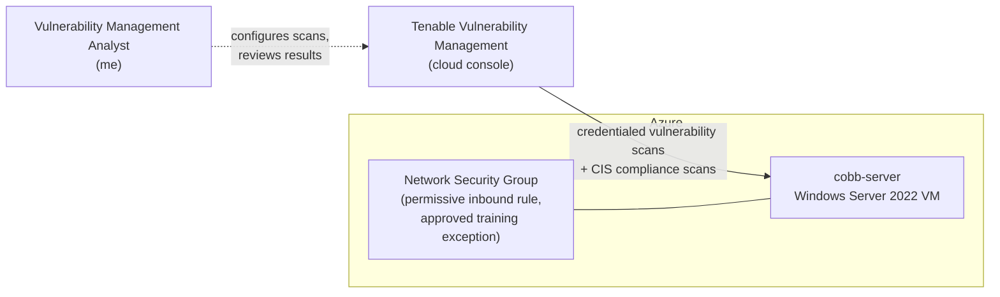

## Vulnerability Management Lab: Hardening a Windows Server 2022 VM in Azure
<!-- TODO: add your name / LinkedIn link here -->

In this project I took a freshly provisioned Windows Server 2022 virtual machine (**cobb-server**) through a full vulnerability management cycle: credentialed vulnerability scanning, triage, remediation, rescanning to verify each fix, formal risk acceptance for findings that couldn't be fixed yet, and a CIS benchmark compliance baseline to drive the next round of hardening.

**Starting state:** an unhardened Windows Server 2022 VM with default settings, exposed through an intentionally permissive inbound network rule (a supervisor-approved training scenario).

**Current state:** every High finding is remediated, all Medium findings are either fixed or formally risk-accepted with compensating controls, a CIS Level 1 compliance baseline has been taken, and hardening against that baseline is underway, with every change recorded in a remediation log.

---

## Lab Environment



<!-- Optional: replace the Mermaid diagram with a draw.io image like Josh's:  -->

## Technology Utilized

- Tenable Vulnerability Management (credentialed vulnerability scans and compliance scans)
- CIS Microsoft Windows Server 2022 Benchmark v2.0.0, Level 1 (Stand-alone)
- Microsoft Azure (Windows Server 2022 VM, Network Security Groups)
- PowerShell, Registry Editor, and Local Security Policy (remediation)

## Table of Contents

- [Step 1) Scope and Authorization](#step-1-scope-and-authorization)
- [Step 2) Initial Credentialed Scan](#step-2-initial-credentialed-scan)
- [Step 3) Triage and Prioritization](#step-3-triage-and-prioritization)
- [Step 4) Vulnerability Remediation](#step-4-vulnerability-remediation)
  - [Remediation Round 1: SMB Signing Not Required](#remediation-round-1-smb-signing-not-required)
  - [Remediation Round 2: WinVerifyTrust Signature Validation (CVE-2013-3900)](#remediation-round-2-winverifytrust-signature-validation-cve-2013-3900)
- [Step 5) Risk Acceptance: Self-Signed RDP Certificate](#step-5-risk-acceptance-self-signed-rdp-certificate)
- [Step 6) CIS Compliance Baseline](#step-6-cis-compliance-baseline)
- [Step 7) Compliance Hardening](#step-7-compliance-hardening)
  - [Hardening Round 1: Disable SMBv1](#hardening-round-1-disable-smbv1)
  - [Hardening Round 2: LAN Manager Authentication Level](#hardening-round-2-lan-manager-authentication-level)
  - [Hardening Round 3: Minimum Password Length](#hardening-round-3-minimum-password-length)
  - [Hardening Round 4: Restrict Outgoing NTLM Traffic (Audit Mode)](#hardening-round-4-restrict-outgoing-ntlm-traffic-audit-mode)
- [First Cycle Summary](#first-cycle-summary)
- [Next Cycle](#next-cycle)
- [Key Takeaways](#key-takeaways)

---

### Step 1) Scope and Authorization

Before scanning anything, scope and permission were confirmed. cobb-server was provisioned from an approved VM catalog specifically for this exercise, and supervisors confirmed in advance that the VM, including its intentionally permissive inbound network rule, was a sanctioned training scenario. That exposure becomes important later in the risk acceptance decision (Step 5).

### Step 2) Initial Credentialed Scan

A credentialed (authenticated) scan was run with Tenable Vulnerability Management. Credentialed scanning logs into the host and inspects registry settings, installed software, and configuration directly, which surfaces far more than an unauthenticated network scan can see.

| Severity | Count |
|---|---|
| Critical | 0 |
| High | 1 |
| Medium | 3 |
| Low | 1 |
| Info | 145 |
| **Total** | **150** |

<!-- TODO: add a screenshot of the scan summary:  -->
<!-- TODO: link the exported report: [Scan 1 - Initial Scan](scans/scan1-initial.pdf) -->

### Step 3) Triage and Prioritization

Each actionable (non-Info) finding was reviewed and given a decision:

| Plugin | Finding | Severity | Decision |
|---|---|---|---|
| 166555 | WinVerifyTrust Signature Validation (CVE-2013-3900) | High | Remediate |
| 57608 | SMB Signing not required | Medium | Remediate |
| 51192 | SSL Certificate Cannot Be Trusted | Medium | Risk accept (see Step 5) |
| 57582 | SSL Self-Signed Certificate | Medium | Risk accept (see Step 5) |
| 10114 | ICMP Timestamp Request Remote Date Disclosure | Low | Deferred to next cycle |

<!-- TODO: add a sentence or two on WHY you ordered the fixes this way. Interviewers love this part. -->

---

### Step 4) Vulnerability Remediation

#### Remediation Round 1: SMB Signing Not Required

**Finding:** 57608, SMB Signing not required (Medium). Without signing, SMB traffic can be tampered with or relayed by an attacker in a man-in-the-middle position.

**Fix:** In Local Security Policy, enabled both "Digitally sign communications (always)" policies, for the Microsoft network client and the Microsoft network server, then restarted the Server service.

**Verification:** Finding absent from the follow-up credentialed scan.

| Severity | Before | After |
|---|---|---|
| High | 1 | 1 |
| Medium | 3 | 2 |
| Low | 1 | 1 |

<!-- TODO: [Scan 2 - SMB Signing Remediation](scans/scan2-smb-signing.pdf) -->

#### Remediation Round 2: WinVerifyTrust Signature Validation (CVE-2013-3900)

**Finding:** 166555, WinVerifyTrust Signature Validation (High). Without the stricter certificate padding check, an attacker can append data to a signed executable without invalidating its Authenticode signature.

**Fix:** Microsoft ships this fix as an opt-in registry setting, so `EnableCertPaddingCheck` was set to `1` (DWORD) under the Wintrust Config key and its 32-bit (Wow6432Node) counterpart via PowerShell:

```powershell
$paths = @(
    "HKLM:\Software\Microsoft\Cryptography\Wintrust\Config",
    "HKLM:\Software\Wow6432Node\Microsoft\Cryptography\Wintrust\Config"
)
foreach ($path in $paths) {
    if (-not (Test-Path $path)) { New-Item -Path $path -Force | Out-Null }
    New-ItemProperty -Path $path -Name "EnableCertPaddingCheck" -Value 1 -PropertyType DWord -Force | Out-Null
}
```
<!-- TODO: swap in the exact script you ran if it differs -->

**Verification:** Finding absent from the follow-up credentialed scan. High findings reached zero.

| Severity | Before | After |
|---|---|---|
| High | 1 | 0 |
| Medium | 2 | 2 |
| Low | 1 | 1 |

<!-- TODO: [Scan 3 - WinVerifyTrust Remediation](scans/scan3-winverifytrust.pdf) -->

---

### Step 5) Risk Acceptance: Self-Signed RDP Certificate

**Findings:** 51192 (SSL Certificate Cannot Be Trusted) and 57582 (SSL Self-Signed Certificate), both Medium.

**Analysis:** Both findings describe the same certificate: the default self-signed certificate Remote Desktop Services generates for port 3389. Replacing it requires a certificate from a trusted CA, which is outside the scope of this exercise.

**Compensating controls:**
- Network Level Authentication (NLA) is enforced (registry value `UserAuthentication` = 1), so users must authenticate before an RDP session is established.
- The permissive inbound network rule is a supervisor-approved, temporary training exception.

**Decision:** Risk accepted, **conditionally**. The acceptance holds only while the exposure stays time-boxed. If the environment outlives the exercise, inbound RDP will be restricted to known IP addresses and the decision revisited.

---

### Step 6) CIS Compliance Baseline

With the vulnerability findings handled, the next question was configuration: does the server match an accepted hardening standard? A compliance scan was run against the **CIS Microsoft Windows Server 2022 Benchmark v2.0.0, Level 1 (Stand-alone)**.

**Baseline result:** 266 failed checks.

One control, 18.4.3 (Certificate Padding), already passed thanks to the WinVerifyTrust fix in Remediation Round 2, a good example of vulnerability remediation and compliance work overlapping.

<!-- TODO: [CIS Baseline Scan](scans/cis-baseline.pdf) -->

### Step 7) Compliance Hardening

#### Hardening Round 1: Disable SMBv1

**Control:** 18.4.2 Configure SMB v1 server: Disabled

**Fix:** Set `SMB1` to `0` under the LanmanServer Parameters registry key, ran the command below, and rebooted.

```powershell
Set-SmbServerConfiguration -EnableSMB1Protocol $false
```

**Verification:** Passed on rescan.

#### Hardening Round 2: LAN Manager Authentication Level

**Control:** 2.3.11.7 Network security: LAN Manager authentication level

**Fix:** Set to **"Send NTLMv2 response only. Refuse LM & NTLM"** in Local Security Policy, so the server no longer accepts the weak LM and NTLMv1 protocols.

**Verification:** Passed on rescan.

#### Hardening Round 3: Minimum Password Length

**Control:** 1.1.4 Minimum password length

**Fix:** Set to 14 characters under Account Policies > Password Policy.

**Verification:** Confirmed working.

#### Hardening Round 4: Restrict Outgoing NTLM Traffic (Audit Mode)

**Control:** 2.3.11.12 Network security: Restrict NTLM: Outgoing NTLM traffic to remote servers

**Fix:** Set to **"Audit all"** rather than "Deny all", then rebooted. Audit mode logs every outgoing NTLM attempt without blocking anything, which shows what still depends on NTLM before enforcement can break it. This mirrors how the change would be rolled out safely in production.

**Verification:** Passed on rescan.

---

### First Cycle Summary

| Metric | Start | Now | Change |
|---|---|---|---|
| High vulnerabilities | 1 | 0 | 100% resolved |
| Medium vulnerabilities | 3 | 2 | 1 fixed, 2 risk-accepted |
| Low vulnerabilities | 1 | 1 | Deferred |
| Open, unaddressed actionable findings | 5 | 1 | 80% reduction |
| CIS Level 1 failed checks | 266 | 262 | 4 controls hardened |

Every High and Medium vulnerability has a documented outcome: fixed and verified by rescan, or formally accepted with compensating controls and a condition for revisiting. All changes are tracked in a remediation log.

<!-- TODO (optional): add a before/after chart image like Josh's:  -->

### Next Cycle

- Review 10114, ICMP Timestamp Request Remote Date Disclosure (Low)
- Continue CIS hardening, starting with:
  - 18.6.14.1 Hardened UNC Paths
  - 2.2.2 Access this computer from the network
  - 18.10.94.2.1 Configure Automatic Updates
  - 1.1.3 Minimum password age
- Revisit the RDP certificate risk acceptance if the environment outlives the exercise

### Key Takeaways

- **Verify every fix with a rescan.** A change isn't done until the scanner agrees.
- **Not every finding gets fixed, but every finding gets a decision.** Risk acceptance is a legitimate outcome when it's documented, justified by compensating controls, and has a clear trigger for revisiting.
- **Roll out restrictive controls in audit mode first.** Logging NTLM usage before denying it avoids breaking things that quietly depend on it.
- **Vulnerability and compliance work overlap.** One registry fix closed a High vulnerability *and* satisfied a CIS control.

<!-- TODO: add one or two takeaways in your own words -->

